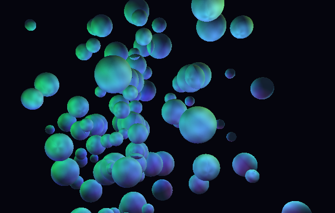

# OpenGL GPU Benchmark

A high-performance OpenGL benchmark that stresses the GPU with millions of triangles per frame, featuring normal mapping, multiple dynamic lights, and real-time performance metrics.



## What It Does

This benchmark renders **100 high-poly spheres** with the following features:

- **13+ million triangles per frame** (100 spheres × 131,072 triangles each)
- **Normal mapping** with tangent-space calculations for realistic surface detail
- **8 dynamic point lights** with physically-based attenuation
- **Temperature-based coloring** - spheres change color based on GPU stress:
  - Blue/Cyan = GPU is cold (high FPS)
  - Yellow/Orange = Moderate load
  - Red = GPU is stressed (low FPS)
- **Real-time FPS counter** displayed in window title
- **Chaotic sphere movement** with layered spiral patterns

## Performance Metrics

The benchmark tracks and displays:
- Total frames rendered
- Average/Min/Max FPS
- Frame time (ms)
- Triangles per frame
- Draw calls per frame
- Number of active lights

## Requirements

### Linux (Ubuntu/Debian)
```bash
sudo apt install libglfw3-dev libglm-dev cmake build-essential
```

### Linux (Fedora)
```bash
sudo dnf install glfw-devel glm-devel cmake gcc-c++
```

### Linux (Arch Linux)
```bash
sudo pacman -S glfw glm cmake
```

## Build

```bash
# Clone the repository
git clone https://github.com/alexdominguez09/opengl-benchmark.git
cd opengl-benchmark

# Create build directory
mkdir build && cd build

# Configure with CMake
cmake ..

# Build
make
```

## Run

```bash
cd build
./opengl-benchmark
```

## Controls

- **ESC** - Exit benchmark and view results

## Output Example

```
OpenGL Version: 4.6 (Core Profile) Mesa 25.2.8-0ubuntu0.24.04.1
Renderer: Mesa Intel(R) UHD Graphics 630 (CFL GT2)
Generating high-poly sphere with 256 subdivisions...
Generated sphere: 66049 vertices, 131072 triangles per instance
Rendering 100 instances = 13107200 triangles per frame
Using 8 point lights

=== Benchmark Results ===
Total Frames: 446
Average FPS: 26.37
Min FPS: 9.38
Max FPS: 184.43
Average Frame Time: 37.92 ms
Triangles per frame: 13107200
Draw calls per frame: 100
Point lights: 8
```

## Technical Details

- **OpenGL Version**: 3.3 Core Profile (compatible with 4.6)
- **Geometry**: Procedurally generated high-poly sphere (256×256 subdivisions)
- **Shaders**: GLSL 330 with Blinn-Phong lighting and normal mapping
- **Libraries**: GLFW, GLM, GLAD, stb_image

## License

This project is licensed under the MIT License - see the [LICENSE](LICENSE) file for details.

## Author

Alex Dominguez - [alexdominguez09](https://github.com/alexdominguez09)
